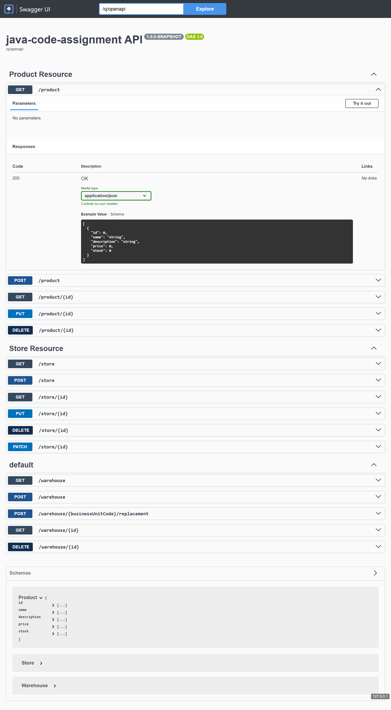
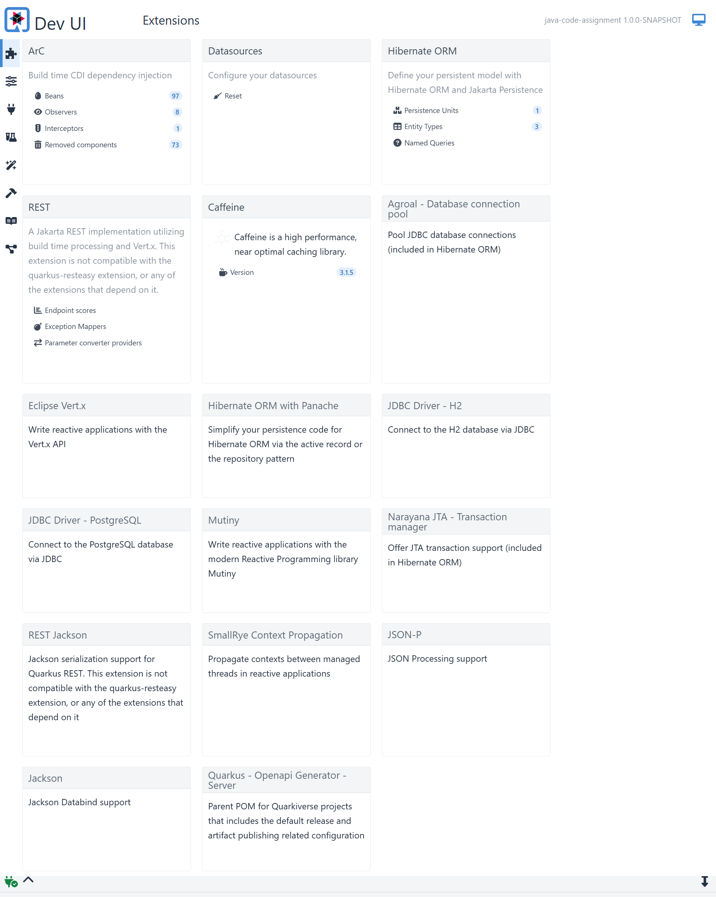
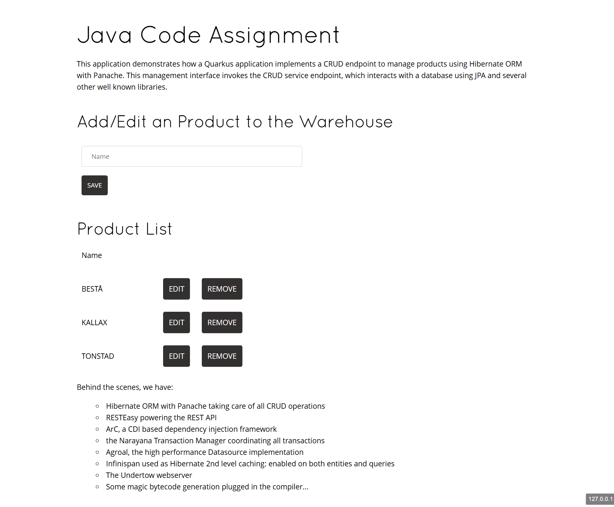

# Warehouse Colocation & Fulfillment System

A Quarkus-based Java application for managing warehouses, stores, products, and fulfillment routing.

## Overview & Architecture

The codebase follows Hexagonal Architecture (Ports & Adapters) and Domain-Driven Design (DDD):

- **Location**: Manages location lookups and checks location capacity limits.
- **Store**: Handles store CRUD and synchronizes with legacy systems after database transaction commits (`@Observes(during = TransactionPhase.AFTER_SUCCESS)`).
- **Product**: Handles product inventory management.
- **Warehouse**: Manages warehouse creation, replacement, and soft-archiving. Validation logic is encapsulated in `WarehouseValidator`.
- **Fulfillment**: Enforces routing constraints between products, stores, and warehouses (`FulfillmentValidator`).

## Package Structure

```
com.fulfilment.application.monolith
├── location/           # LocationResolver port & gateway
├── stores/             # Store entity, resource, and legacy sync observer
├── products/           # Product entity, repository, and resource
├── warehouses/
│   ├── domain/
│   │   ├── models/     # Warehouse, Location
│   │   ├── ports/      # WarehouseStore, operation interfaces
│   │   ├── validators/ # WarehouseValidator
│   │   └── usecases/   # Create, Replace, Archive use cases
│   └── adapters/
│       ├── database/   # DbWarehouse, WarehouseRepository
│       └── restapi/    # WarehouseResourceImpl
└── fulfillment/
    ├── domain/
        ├── models/     # ProductStoreFulfillment
        ├── validators/ # FulfillmentValidator
        └── usecases/   # FulfillmentService
```

## Key Business Rules

1. **Warehouse Replacement**:
   - Replacement capacity must accommodate existing stock.
   - Replacement stock must match the old warehouse stock.
   - Old warehouse is soft-archived with `archivedAt` timestamp to preserve historical data.

2. **Fulfillment Constraints**:
   - Max 2 warehouses per product per store.
   - Max 3 warehouses per store.
   - Max 5 product types per warehouse.

## How to Run

### Requirements
- JDK 17+

### Run Tests & Code Coverage
```bash
./mvnw test
```
*JaCoCo coverage report is generated at `target/site/jacoco/index.html`.*

### Run in Dev Mode
```bash
./mvnw quarkus:dev
```
Swagger UI will be available at: `http://localhost:8080/q/swagger-ui`

## Screenshots

### 1. JaCoCo Code Coverage Report (>80%)


### 2. Test Suite Execution & Build Success


### 3. Swagger UI API Documentation


### 4. Quarkus Dev UI & Application Dashboard

